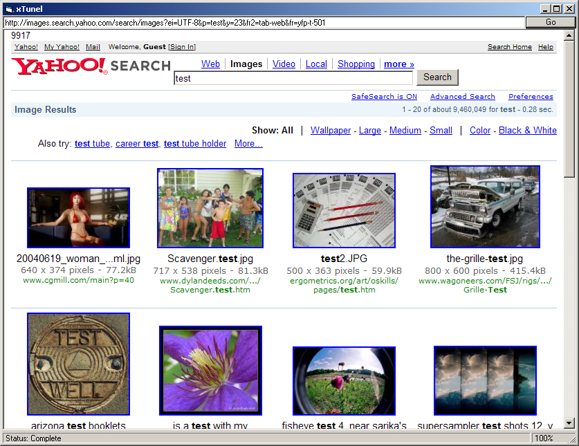



## PoC \[Proof\-of\-Concept\] xTunel \- HTTP Data over Socket by WebBrowser

### Description

The point is easy. You are very limited by the WebBrowser Control alone, what if you want to like filter out some HTML Code which you can only do when its received by the WebBrowser? - Maybe too late action because the WebBrowser executes/process the Data on-fly as usual. xTunel is not using the WebBrowser to receive/send data, its blocking the existing request from the WebBrowser Control and transfer the request to the Socket to let the Socket takeover all action, after all Data is received you can filter/trim/clean the data or whatever u want to do with it, after the Data is fully received it will be displayed like standart in the WebBrowser control. Its only PoC - Proof of Concept but i believe you gonna see very soon how good something like this is!
 
### More Info
 

             |
---                |---
**Submitted On**   |2007-07-23 13:50:02
**By**             |[cIntX](https://github.com/Planet-Source-Code/PSCIndex/blob/master/ByAuthor/cintx.md)
**Level**          |Intermediate
**User Rating**    |5.0 (10 globes from 2 users)
**Compatibility**  |VB 5\.0, VB 6\.0
**Category**       |[Internet/ HTML](https://github.com/Planet-Source-Code/PSCIndex/blob/master/ByCategory/internet-html__1-34.md)
**World**          |[Visual Basic](https://github.com/Planet-Source-Code/PSCIndex/blob/master/ByWorld/visual-basic.md)
**Archive File**   |[PoC\_\[Proof2076767232007\.zip](https://github.com/Planet-Source-Code/cintx-poc-proof-of-concept-xtunel-http-data-over-socket-by-webbrowser__1-69048/archive/master.zip)

